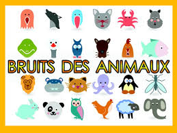

# A.V.A.T.A.R-plugin-CrisDesAnimaux

- This plugin is an add-on for the [A.V.A.T.A.R](https://avatar-home-automation.github.io/docs) framework. 

- 70 son d'animaux, domestique , sauvage

"C:\avatar\Server\re
 ## 🎯 Usage
Commandes :
- quel est est le son/le cris du cheval, joue le son du chameau
- depuis sur n'importe quel client jouer des son d'animaux

## Multi-room

The `CrisDesAnimaux` plugin is fully multi-room.

## Multi-language

The `CrisDesAnimaux` plugin relies solely on the system's available languages.

 <table style="border: none;">
  <tr>
    <td style="border: none;"></td>
    <td style="border: none;">
      <h1 style="margin: 0;color: brown;">CrisDesAnimaux</h1>
      <h3 style="margin: 0;">Get Sound Animals</h3>
    </td>
  </tr>
</table>
